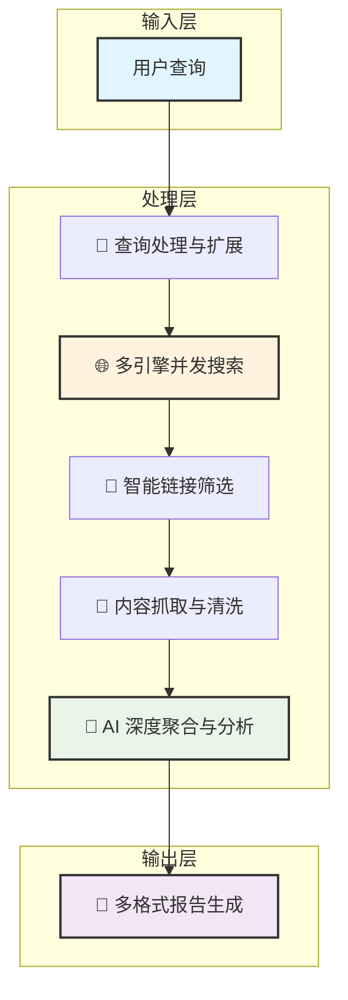

<div align="center">

# 🔬 AstrBot Deep Research Plugin

**一个为 AstrBot 设计的 AI 深度研究插件，利用多引擎并发搜索和 LLM 技术，为您生成全面、深入、多维度的研究报告。**

<p>
  <a href="https://github.com/lxfight/astrbot_plugin_deepresearch/releases"></a>
  <a href="#"></a>
  <a href="#"></a>
  <a href="./LICENSE"></a>
</p>

<p>
  
  
  
</p>

</div>

---

## 📖 目录 (Table of Contents)

- [✨ 核心特性](#-核心特性)
- [🚀 快速上手](#-快速上手)
- [🗺️ 路线图 (Roadmap)](#️-路线图-roadmap)
- [🏗️ 技术架构](#️-技术架构)
- [🤝 如何贡献](#-如何贡献)
- [📄 开源许可](#-开源许可)
- [🔗 相关链接](#-相关链接)

## ✨ 核心特性

<table>
<tr>
<td width="50%" valign="top">

### 🔍 智能多引擎搜索
- **并发搜索**：同时调用 **8+** 主流搜索引擎，最大化信息覆盖面。
- **广泛覆盖**：无缝整合**中文**及**国际**搜索引擎，打破信息壁垒。
- **毫秒级响应**：优化的异步架构，确保快速返回搜索结果。
- **智能容错**：单个引擎故障不影响整体流程，保证服务稳定性。

</td>
<td width="50%" valign="top">

### 🧠 AI 驱动的深度分析
- **LLM 赋能**：利用大语言模型深刻理解、总结和重构搜索内容。
- **四阶段处理**：通过`查询扩展` -> `链接筛选` -> `内容聚合` -> `报告生成`的标准化流程，确保报告质量。
- **智能筛选**：自动过滤低质量、不相关的链接，提取高价值信息。
- **自动摘要**：从海量文本中生成精炼、准确的摘要和结论。

</td>
</tr>
<tr>
<td width="50%" valign="top">

### 🎨 灵活的多格式输出
- **精美图片**：将报告渲染为适合移动端分享和查看的图片。
- **Markdown 文档**：提供结构化的 `.md` 文件，便于二次编辑和归档。
- **交互式 HTML**：生成独立的网页，提供更丰富的交互体验。
- **移动端优化**：所有输出格式均对移动设备友好。

</td>
<td width="50%" valign="top">

### ⚡ 高性能与高可用架构
- **全异步设计**：基于 `asyncio` 构建，实现高效的 I/O 并发处理。
- **智能重试**：内置网络请求重试机制，从容应对临时性网络问题。
- **速率限制**：智能处理搜索引擎的速率限制，避免被封禁。
- **模块化设计**：代码结构清晰，易于扩展和维护新的搜索引擎或功能。

</td>
</tr>
</table>

## 🚀 快速上手

### 基础用法

通过向 AstrBot 发送指令来触发深度研究：

```sh
# 默认使用 Markdown 格式进行研究
/deepresearch 人工智能的未来发展趋势

# 指定输出为 image 格式
/deepresearch Python编程最佳实践 image

# 指定输出为 html 格式
/deepresearch 区块链技术应用 html
```

### 高级选项

<details>
<summary>🔧 <strong>支持的搜索引擎</strong></summary>

| 搜索引擎 | 类型 | 特色 | 状态 |
| :--- | :--- | :--- | :---: |
| 🔍 百度搜索 | 中文 | 中文内容覆盖最全 | ✅ |
| 🌐 Bing 搜索 | 国际 | 国际化内容丰富，结果质量高 | ✅ |
| 🦆 DuckDuckGo | 隐私 | 注重用户隐私，无追踪 | ✅ |
| 🔍 搜狗搜索 | 中文 | 智能中文检索 | ✅ |
| 🎯 360 搜索 | 中文 | 本土化搜索体验 | ✅ |
| ... | ... | ... | ... |

</details>

<details>
<summary>📊 <strong>支持的输出格式</strong></summary>

| 格式 | 命令 | 适用场景 | 特点 |
| :---: | :---: | :--- | :--- |
| 📝 **Markdown** | (默认) | 文档编辑、二次创作 | 格式通用，便于复制和修改 |
| 🖼️ **Image** | `image` | 移动端分享、快速预览 | 精美排版，一图胜千言 |
| 🌐 **HTML** | `html` | 网页展示、完整报告 | 交互性强，包含所有源链接 |

</details>

## 🗺️ 路线图 (Roadmap)

我们正在积极开发中，欢迎您参与进来！

#### ✅ 已完成

- [x] 核心搜索与内容抓取框架
- [x] 集成多个主流搜索引擎
- [x] 集成大语言模型（LLM）进行内容分析与聚合
- [x] 实现 Markdown, Image, HTML 多格式报告输出
- [x] 基础的异步与并发性能优化

#### 🎯 近期规划

- [ ] **增强结果准确性**：引入更先进的链接质量评估模型。
- [ ] **引入缓存机制**：为相同查询提供缓存，减少重复请求和LLM开销。
- [ ] **自定义搜索引擎**：允许用户在配置文件中启用/禁用特定的搜索引擎。
- [ ] **完善单元测试**：提升代码测试覆盖率，保证项目稳定性。
- [ ] **优化文档**：提供更详细的配置和二次开发指南。

## 🏗️ 技术架构

本插件采用分层处理架构，确保流程清晰可控。

<details>
<summary><strong>👉 点击查看技术架构图</strong></summary>

<div align="center">



</div>
</details>

## 🤝 如何贡献

我们热烈欢迎各种形式的贡献，无论是报告问题、提交新功能还是改进文档！

1.  **Fork** 本仓库
2.  创建您的特性分支 (`git checkout -b feature/AmazingFeature`)
3.  提交您的更改 (`git commit -m 'Add some AmazingFeature'`)
4.  推送到分支 (`git push origin feature/AmazingFeature`)
5.  创建一个 **Pull Request**

<div align="center">
<br>
<a href="https://github.com/lxfight/astrbot_plugin_deepresearch/issues"></a>
&nbsp;
<a href="https://github.com/lxfight/astrbot_plugin_deepresearch/pulls"></a>
<br><br>
</div>

## 📄 开源许可

本项目基于 [AGPL-3.0](LICENSE) 协议开源。请确保在使用前了解其条款。

## 🔗 相关链接

- 🏠 **AstrBot 主项目**: [github.com/AstrBotDevs/AstrBot](https://github.com/AstrBotDevs/AstrBot)

---
11
<div align="center">

### 🌟 如果这个项目对您有帮助，请考虑给一个 Star ⭐
  

### 如果这个项目对您有帮助，请给一个 Star ⭐ 支持我们！

<a href="https://github.com/lxfight/astrbot_plugin_deepresearch/stargazers">
  
</a>

<br>

<sub>最后更新：2025-06-18</sub>

</div>