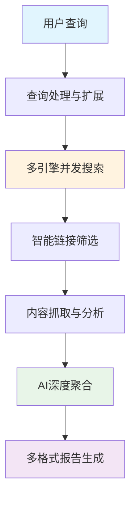

<div align="center">

# 🔬 AstrBot Deep Research Plugin


<p>
  
  
  
  
</p>

<p>
  
  
  
</p>

### 🤖 AI驱动的智能深度研究助手

> 一个革命性的研究插件，利用多搜索引擎并发技术和大语言模型，为您提供深度、全面的研究报告

</div>

---

## 🚧 项目状态

<div align="center">

```
🔨 该项目正在积极开发中 🔨

当前版本为早期预览版，功能可能存在变化
欢迎提交 Issue 和 Pull Request！
```

</div>

## ✨ 核心特性

<table>
<tr>
<td width="50%">

### 🔍 **智能搜索引擎**
- 🎯 **8个搜索引擎**并发搜索
- 🌏 覆盖**中文**和**国际**内容
- ⚡ **毫秒级**响应速度
- 🛡️ **容错机制**保证稳定性

</td>
<td width="50%">

### 🧠 **AI深度分析**
- 🤖 **LLM驱动**的内容理解
- 📊 **四阶段**研究流程
- 🔗 **智能链接**筛选
- 📝 **自动摘要**生成

</td>
</tr>
<tr>
<td width="50%">

### 🎨 **多格式输出**
- 🖼️ **精美图片**报告
- 📝 **Markdown**文档
- 🌐 **HTML**页面
- 📱 **移动端**友好

</td>
<td width="50%">

### ⚡ **高性能架构**
- 🔄 **并发处理**技术
- 🔁 **智能重试**机制
- 📈 **速率限制**处理
- 🏗️ **模块化**设计

</td>
</tr>
</table>

## 🚀 快速开始

### 💬 基础用法

```bash
# 🔍 简单搜索
/deepresearch 人工智能的未来发展趋势

# 📝 Markdown格式输出
/deepresearch Python编程最佳实践 --format=markdown

# 🌐 HTML格式输出  
/deepresearch 区块链技术应用 --format=html
```

### 🎯 高级功能

<details>
<summary>🔧 <strong>支持的搜索引擎</strong></summary>

| 搜索引擎 | 类型 | 特色 |
|---------|------|------|
| 🔍 百度搜索 | 中文 | 中文内容覆盖最全 |
| 🌐 Bing搜索 | 国际 | 国际化内容丰富 |
| 🦆 DuckDuckGo | 隐私 | 无追踪隐私保护 |
| 🔍 搜狗搜索 | 中文 | 智能中文检索 |
| 🎯 360搜索 | 中文 | 本土化搜索体验 |

</details>

<details>
<summary>📊 <strong>输出格式选择</strong></summary>

| 格式 | 适用场景 | 特点 |
|------|----------|------|
| 🖼️ **image** | 移动端分享 | 精美可视化 |
| 📝 **markdown** | 文档编辑 | 便于二次编辑 |
| 🌐 **html** | 网页展示 | 交互体验好 |

</details>

## 🏗️ 技术架构

<div align="center">



</div>


## 🛠️ 开发状态

<div align="center">

### 📅 开发进度

```
▓▓▓▓▓▓▓░░░ 70% 完成

✅ 核心搜索功能      ✅ 多引擎支持
✅ LLM集成          ✅ 多格式输出  
🔄 性能优化         📋 文档完善
🚧 测试覆盖
```

</div>

### 🎯 近期规划

- [ ] 🔧 **搜索引擎优化** - 提升解析准确率
- [ ] 📊 **缓存机制** - 减少重复请求
- [ ] 📈 **提升信息准确性** - 优化结果筛选与聚合

## 🤝 贡献指南

<div align="center">

**我们欢迎所有形式的贡献！**

<a href="https://github.com/lxfight/astrbot_plugin_deepresearch/issues">
  
</a>
<a href="https://github.com/lxfight/astrbot_plugin_deepresearch/pulls">
  
</a>

</div>


## 📄 许可证

<div align="center">

本项目采用 [AGPL v3](LICENSE) 开源协议


---

**Made with ❤️ for the AstrBot Community**

<p>
  
</p>

</div>

## 🔗 相关链接

- 🏠 [AstrBot 主项目](https://github.com/AstrBotDevs/AstrBot)


---

<div align="center">

### 🌟 如果这个项目对您有帮助，请考虑给一个 Star ⭐

<sub>最后更新：2025-06-13 | 版本：v0.2.0</sub>

</div>
